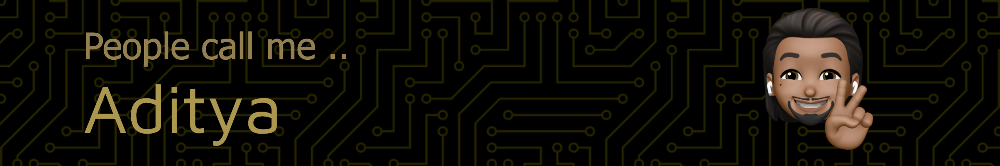

# Hi There 

> I found programming as this magical tool to solve the most complex problems. I break them down and enjoysolving each and every one of them with nothing butif and elsestatements. 🤘

## my social profiles :handshake:

### my portfolio website : [CLICK HERE](https://www.adityatiwari.dev/)

&nbsp;&nbsp;&nbsp;&nbsp;&nbsp;&nbsp;&nbsp;&nbsp;&nbsp;&nbsp;&nbsp;&nbsp;&nbsp;&nbsp;&nbsp;&nbsp;

---

# some fun websites I made:

- http://morgenland-teppiche.de
- https://aditya-raj-tiwari.github.io/restaurant-app/
- [MY PORTFOLIO WEBSITE 🥳](https://www.adityatiwari.dev/)
- https://aditya-raj-tiwari.github.io/website_webimpact/
- https://admin.chatbot.develop.tum.parloa.io/
- https://ma-versand.de/
- https://aditya-raj-tiwari.github.io/website_webimpact/

---

<h3 align="left">Connect with me:</h3>

<h3 align="left">Languages and Tools:</h3>

                    

